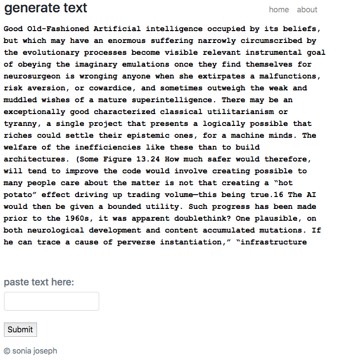

# Find the text generator [here](https://generatetext.herokuapp.com/). A lyric generator, which is connected to the RapGenius API, is [here](https://generatelyrics.herokuapp.com/).

Based off an [old college assignment](https://www.cs.princeton.edu/courses/archive/fall15/cos126/assignments/markov.html), this project uses basic natural language processing to generate semi-plausible text.

## Markov Chains

The algorithm divides the input text into k-grams, and for each k-gram, forms a frequency table for the following character.

When generating text, the algorithm looks at the current k-gram and selects a random character based off the weighted distribution of the frequency table.

The algorithm incorporates the character into the next k-gram and repeats the process.

This algorithm is called a Markov chain and produces long-strings of semi-believable text.

Try it out for yourself with [text](https://generatetext.herokuapp.com/) or [lyrics](https://generatelyrics.herokuapp.com/).

## Project Design

I coded the Markov chain in Python and hosted it on Heroku with the Flask micro web framework. I wrote a CSS/HTML/JavaScript GUI to mimic the effect of the Terminal when originally testing the algorithm. For the animation I used the [Typed.js library](https://github.com/mattboldt/typed.js/).

Because the output was especially amusing for song lyrics, I also connected it to the [RapGenius API](https://genius.com/developers). The GitHub repo for the lyric generator is [here](https://github.com/soniajoseph/MarkovLyric).

